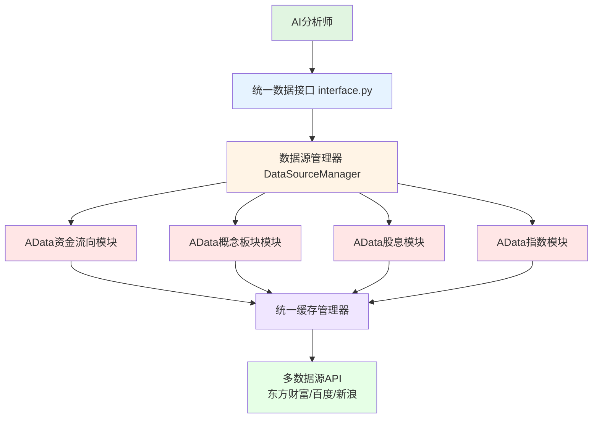

# 设计文档

## 项目概述

本设计将AData市场数据模块无缝集成到TradingAgents-CN的现有数据流架构中，通过扩展DataSourceManager和统一接口模式，为AI分析师提供资金流向、概念板块、股息和指数数据分析能力。设计遵循项目的模块化架构、延迟导入机制和统一缓存策略。

## 指导文档对齐

### 技术标准遵循
- **模块化设计**: 每个数据提供者作为独立模块，符合项目的单一职责原则
- **延迟导入机制**: 遵循现有的动态导入模式，仅在需要时加载AData功能
- **统一接口模式**: 扩展现有的统一数据接口(`get_china_stock_data_unified`)，添加新的数据类型
- **缓存集成**: 充分利用项目的统一缓存管理器(`unified_cache_manager`)

### 项目结构遵循
- 新模块放置在数据流目录下
- 遵循现有命名规范：`market_data_*_utils.py`
- 与现有的数据源管理器（`data_source_manager.py`）集成
- 在`interface.py`中暴露统一API

## 代码复用分析

### 现有组件复用
- **DataSourceManager**: 扩展现有类，添加AData数据源支持
- **统一缓存管理器**: 复用`unified_cache_manager`进行数据缓存
- **日志系统**: 复用`logging_manager`和`logging_init`统一日志
- **错误处理机制**: 复用现有的异常处理和降级策略

### 集成点
- **interface.py**: 添加新的数据获取函数到统一接口
- **__init__.py**: 扩展动态导入映射，支持AData函数
- **data_source_manager.py**: 集成AData作为新的数据源选项
- **现有缓存系统**: 无缝集成到统一缓存架构

## 架构设计

本设计采用分层架构，确保与现有系统的兼容性和可扩展性：

### 模块化设计原则
- **单文件职责**: 每个AData数据类型（资金流向、概念、股息、指数）独立模块
- **组件隔离**: 新模块与现有代码松耦合，可独立测试和维护
- **服务层分离**: 数据访问、业务逻辑和表示层清晰分离
- **工具模块化**: AData工具函数按功能分组，支持选择性导入



## 组件和接口

### 组件1: 资金流向提供器 (market_data_capital_flow_utils.py)
- **目的**: 提供个股和概念的资金流向数据分析
- **接口**:
  - `get_stock_capital_flow(symbol, start_date, end_date)` - 获取个股资金流向
  - `get_concept_capital_flow(concept_code)` - 获取概念资金流向
  - `get_capital_flow_realtime(symbol)` - 获取实时资金流向
- **依赖**: 统一缓存管理器、日志系统、市场数据核心模块
- **复用**: 集成到DataSourceManager的多源降级机制

### 组件2: 概念板块提供器 (market_data_concept_utils.py)
- **目的**: 提供概念板块行情和成分股分析
- **接口**:
  - `get_concept_ranking()` - 获取概念板块排名
  - `get_concept_stocks(concept_code)` - 获取概念成分股
  - `get_stock_concepts(symbol)` - 获取股票所属概念
- **依赖**: 统一缓存管理器、日志系统
- **复用**: 复用现有的数据格式化和错误处理机制

### 组件3: 股息提供器 (market_data_dividend_utils.py)
- **目的**: 提供完整的股息历史和分红政策分析
- **接口**:
  - `get_stock_dividend_history(symbol)` - 获取历史分红数据
  - `get_dividend_calendar(start_date, end_date)` - 获取分红日历
  - `calculate_dividend_yield(symbol, price)` - 计算股息率
- **依赖**: pandas数据处理、统一缓存管理器
- **复用**: 复用现有的日期处理和数据验证机制

### 组件4: 指数提供器 (market_data_index_utils.py)
- **目的**: 提供全面的指数数据和基准分析
- **接口**:
  - `get_index_data(index_code, start_date, end_date)` - 获取指数历史数据
  - `get_index_realtime(index_code)` - 获取指数实时数据
  - `get_sector_indices()` - 获取行业指数列表
- **依赖**: 统一缓存管理器、现有的数据格式化工具
- **复用**: 复用现有的市场数据处理流程

### 组件5: 简化集成 (扩展现有DataSourceManager)
- **目的**: 直接扩展现有DataSourceManager，避免额外抽象层
- **接口**: 在现有类中添加新方法
- **依赖**: 现有DataSourceManager
- **复用**: 完全复用现有架构，不添加新的管理层

## 数据模型

### 资金流向数据模型
```python
CapitalFlowData = {
    'symbol': str,           # 股票代码
    'trade_date': str,       # 交易日期
    'main_inflow': float,    # 主力资金流入
    'main_outflow': float,   # 主力资金流出
    'main_net': float,       # 主力资金净额
    'retail_inflow': float,  # 散户资金流入
    'retail_outflow': float, # 散户资金流出
    'retail_net': float,     # 散户资金净额
    'super_large': float,    # 超大单净额
    'large': float,          # 大单净额
    'medium': float,         # 中单净额
    'small': float,          # 小单净额
    'data_source': str       # 数据源标识
}
```

### 概念板块数据模型
```python
ConceptData = {
    'concept_code': str,     # 概念代码
    'concept_name': str,     # 概念名称
    'change_pct': float,     # 涨跌幅
    'volume': float,         # 成交量
    'amount': float,         # 成交额
    'market_value': float,   # 总市值
    'constituent_count': int,# 成分股数量
    'leader_stocks': List[str], # 龙头股票
    'data_source': str       # 数据源标识
}
```

### 股息数据模型
```python
DividendData = {
    'symbol': str,           # 股票代码
    'announce_date': str,    # 公告日期
    'dividend_plan': str,    # 分红方案
    'ex_dividend_date': str, # 除息日期
    'cash_dividend': float,  # 现金分红
    'stock_dividend': float, # 股票分红
    'dividend_yield': float, # 股息率
    'payout_ratio': float,   # 分红比例
    'data_source': str       # 数据源标识
}
```

### 指数数据模型
```python
IndexData = {
    'index_code': str,       # 指数代码
    'index_name': str,       # 指数名称
    'trade_date': str,       # 交易日期
    'open': float,           # 开盘价
    'high': float,           # 最高价
    'low': float,            # 最低价
    'close': float,          # 收盘价
    'volume': float,         # 成交量
    'amount': float,         # 成交额
    'change': float,         # 涨跌额
    'change_pct': float,     # 涨跌幅
    'data_source': str       # 数据源标识
}
```

## 错误处理

### 错误场景
1. **数据源不可用**
   - **处理**: 自动切换到备用数据源（东方财富 → 百度 → 新浪）
   - **用户影响**: 透明切换，用户无感知，在日志中记录切换信息

2. **API限流或配额用尽**
   - **处理**: 启用缓存数据，设置重试间隔，显示数据新鲜度警告
   - **用户影响**: 使用历史缓存数据，显示"数据可能不是最新"提示

3. **数据格式异常**
   - **处理**: 数据验证和清洗，记录异常数据，使用默认值填充
   - **用户影响**: 显示"部分数据异常"警告，但不影响整体分析

4. **网络连接失败**
   - **处理**: 重试机制，使用本地缓存，降级到基础数据
   - **用户影响**: 显示"网络异常，使用缓存数据"提示

5. **配置缺失或无效**
   - **处理**: 使用默认配置，记录配置问题，提供配置修复建议
   - **用户影响**: 显示配置问题提示和修复建议

## 测试策略

### 单元测试
- **数据提供器测试**: 测试每个AData模块的核心功能和数据解析
- **缓存机制测试**: 验证缓存的存储、检索和过期机制
- **错误处理测试**: 模拟各种异常情况，验证降级和恢复机制
- **数据验证测试**: 确保数据格式和质量符合预期

### 集成测试
- **多数据源集成测试**: 验证数据源切换和降级机制的正确性
- **缓存集成测试**: 验证与统一缓存管理器的集成功能
- **AI分析师集成测试**: 测试新数据在AI分析流程中的使用效果
- **性能集成测试**: 验证数据获取的响应时间和并发处理能力

### 端到端测试
- **完整分析流程测试**: 从股票输入到最终分析报告的全流程测试
- **多市场数据融合测试**: 验证A股、港股、美股数据的协同分析
- **实时数据更新测试**: 测试实时数据获取和分析更新机制
- **用户场景测试**: 模拟真实用户的使用场景和操作流程

## 实施计划

### 第一阶段：核心功能 (1周) - MVP优先
1. 实现资金流向数据获取 - 最高价值功能
2. 扩展现有DataSourceManager添加新数据源
3. 基础测试和集成

### 第二阶段：扩展功能 (1周)
1. 添加概念板块和股息数据
2. 完善缓存和错误处理
3. 性能测试

### 第三阶段：系统完善 (1周)
1. 为AI分析师添加新数据工具
2. 端到端测试
3. 文档完善

## 执行效率优化设计

### 核心效率策略 (避免过度设计)
- **复用现有并发机制**: 利用项目已有的异步处理能力
- **简化缓存策略**: 只使用现有的统一缓存管理器，避免复杂分层
- **最小化API调用**: 批量获取，智能合并相似请求
- **快速失败**: 简单的超时和重试机制

### 简化缓存策略
- **统一缓存**: 复用现有unified_cache_manager
- **简单TTL**: 实时数据5分钟，历史数据1小时
- **内存优先**: 热点数据内存缓存，其他数据按需获取

## 性能和安全考虑

### 简化性能目标
- **响应时间**: API调用<5秒，缓存命中<1秒
- **并发支持**: 支持现有AI分析师并发需求
- **缓存策略**: 简单有效的缓存，提升用户体验

### 安全措施
- **API密钥管理**: 加密存储，环境变量隔离
- **速率限制**: 防止API滥用，保护数据源稳定性
- **数据验证**: 严格的输入验证和输出清洗
- **错误日志脱敏**: 避免在日志中暴露敏感信息