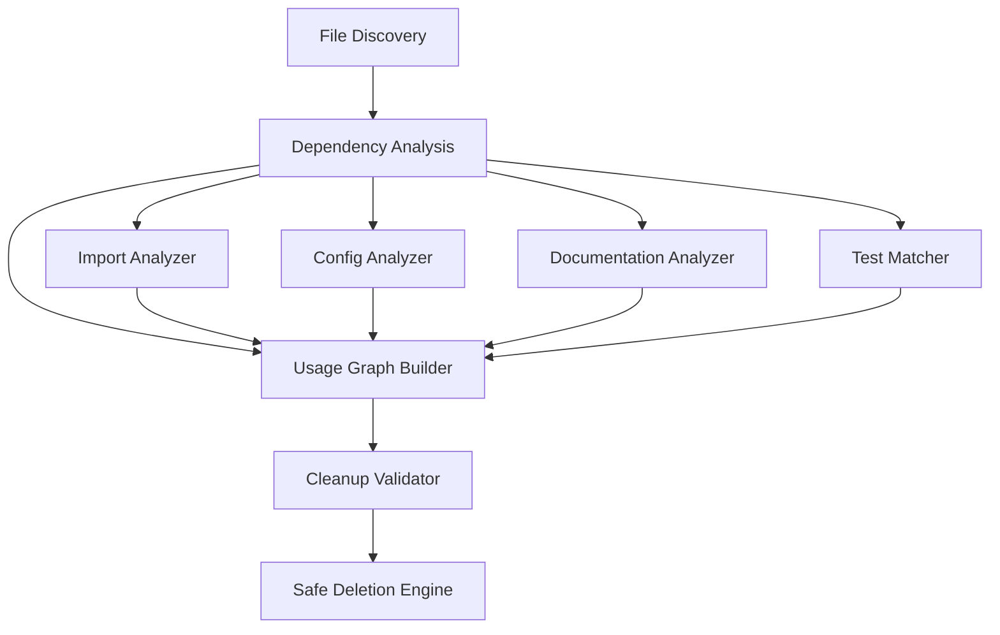

# Design Document

## Overview

The file cleanup analysis feature will systematically analyze the TradingAgents-CN project to identify and safely remove unused files. The system will use dependency analysis, import tracking, and configuration scanning to build a comprehensive usage map before making deletion recommendations.

## Steering Document Alignment

### Technical Standards (tech.md)
This design follows modular design principles by creating focused analysis components that can be reused for future codebase maintenance tasks.

### Project Structure (structure.md)
The implementation will leverage existing project structure conventions and maintain the current organization while removing unused artifacts.

## Code Reuse Analysis

### Existing Components to Leverage
- **File system utilities**: Use existing file operations patterns from the project
- **Python AST parsing**: Leverage any existing code analysis utilities
- **Logging system**: Use the project's existing logging infrastructure from `tradingagents/utils/logging_manager.py`

### Integration Points
- **Project configuration**: Integrate with existing pyproject.toml and requirements.txt
- **Documentation system**: Check references in existing README and docs files
- **Testing framework**: Ensure cleanup doesn't break existing test patterns

## Architecture

The file cleanup system uses a multi-stage analysis pipeline that builds a comprehensive usage graph before making any deletions.

### Modular Design Principles
- **Single File Responsibility**: Each analyzer handles one specific file type or reference pattern
- **Component Isolation**: Separate analysis, validation, and deletion phases
- **Service Layer Separation**: Distinct layers for file discovery, dependency analysis, and cleanup execution
- **Utility Modularity**: Focused utilities for different analysis types (imports, configs, documentation)



## Components and Interfaces

### File Discovery Component
- **Purpose:** Recursively scan project directories and catalog all files
- **Interfaces:** `discover_files(root_path, exclude_patterns) -> FileList`
- **Dependencies:** File system access
- **Reuses:** Standard Python pathlib and os modules

### Dependency Analysis Component
- **Purpose:** Analyze how files reference each other through imports, configurations, and documentation
- **Interfaces:** `analyze_dependencies(file_list) -> DependencyGraph`
- **Dependencies:** Python AST parser, regex patterns
- **Reuses:** Built-in ast module, existing file reading utilities

### Import Analyzer
- **Purpose:** Parse Python files to extract import statements and build import dependency chains
- **Interfaces:** `analyze_imports(python_file) -> ImportList`
- **Dependencies:** Python AST parser
- **Reuses:** Standard ast module

### Configuration Analyzer
- **Purpose:** Scan configuration files for file references (pyproject.toml, docker-compose, etc.)
- **Interfaces:** `analyze_config_references(config_files) -> ReferenceList`
- **Dependencies:** TOML/YAML/JSON parsers
- **Reuses:** Standard library parsers

### Documentation Analyzer
- **Purpose:** Extract file references from documentation files (README, docs/, comments)
- **Interfaces:** `analyze_doc_references(doc_files) -> ReferenceList`
- **Dependencies:** Text parsing, markdown parsing
- **Reuses:** Regex patterns, existing text utilities

### Usage Graph Builder
- **Purpose:** Combine all analysis results into a comprehensive usage graph
- **Interfaces:** `build_usage_graph(analyses) -> UsageGraph`
- **Dependencies:** All analyzer components
- **Reuses:** Graph data structures

### Cleanup Validator
- **Purpose:** Validate that proposed deletions are safe and won't break the system
- **Interfaces:** `validate_deletions(usage_graph, deletion_candidates) -> ValidationResult`
- **Dependencies:** Usage graph, safety rules
- **Reuses:** Project configuration knowledge

### Safe Deletion Engine
- **Purpose:** Execute validated file deletions with proper logging and error handling
- **Interfaces:** `execute_deletions(validated_deletions) -> DeletionResult`
- **Dependencies:** File system operations, logging
- **Reuses:** Existing logging infrastructure

## Data Models

### FileNode
```python
- path: str (absolute file path)
- file_type: str (python, config, documentation, image, etc.)
- size: int (file size in bytes)
- last_modified: datetime
- purpose: str (inferred purpose of the file)
```

### DependencyEdge
```python
- source_file: str (file that references)
- target_file: str (file being referenced)
- reference_type: str (import, config, documentation, etc.)
- line_number: int (where reference occurs)
- confidence: float (0.0-1.0 confidence in the reference)
```

### UsageGraph
```python
- files: Dict[str, FileNode] (all discovered files)
- dependencies: List[DependencyEdge] (all references between files)
- unused_files: List[str] (files with no incoming dependencies)
- critical_files: List[str] (files that should never be deleted)
```

### CleanupResult
```python
- deleted_files: List[str] (successfully deleted files)
- skipped_files: List[str] (files skipped for safety)
- errors: List[str] (deletion errors encountered)
- space_freed: int (bytes freed by cleanup)
```

## Error Handling

### Error Scenarios
1. **File Permission Errors:** Files that cannot be read or deleted due to permissions
   - **Handling:** Log error and skip file, continue with other files
   - **User Impact:** Warning message about skipped files

2. **Parse Errors:** Python files with syntax errors that cannot be parsed
   - **Handling:** Log parsing error but don't assume file is unused
   - **User Impact:** File marked as "unable to analyze" in report

3. **Dependency Analysis Failures:** Errors in analyzing specific file types
   - **Handling:** Use fallback analysis methods, err on side of caution
   - **User Impact:** More conservative deletion recommendations

4. **Deletion Failures:** Files that exist but cannot be deleted
   - **Handling:** Log specific error, continue with remaining deletions
   - **User Impact:** Clear error reporting with suggested manual actions

## Testing Strategy

### Unit Testing
- Test each analyzer component independently with mock file systems
- Validate dependency graph building with known file structures
- Test edge cases like circular imports and missing files

### Integration Testing
- Test full analysis pipeline on controlled test project structures
- Validate that critical files are never marked for deletion
- Test cleanup validation logic with various project configurations

### End-to-End Testing
- Run analysis on copy of actual project to validate results
- Test deletion execution on non-critical test files
- Validate that project still functions after cleanup