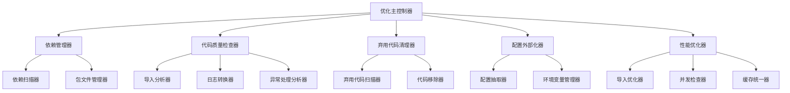

# 项目优化设计文档

## 概述

本设计文档详细描述了TradingAgents-CN项目的全面优化方案。通过系统性的重构和改进，提升代码质量、性能和可维护性。优化工作涉及依赖管理、代码清理、配置管理、日志统一和性能提升等多个方面。

## 技术标准对齐

### 现有技术模式
- **模块化架构**: 项目已采用分层架构（agents、dataflows、utils等）
- **日志系统**: 已有统一日志管理器(`tradingagents.utils.logging_manager`)
- **配置管理**: 使用DEFAULT_CONFIG模式和配置传递机制
- **类型提示**: 广泛使用typing模块进行类型标注

### 项目结构规范
- **包结构**: 遵循现有的`tradingagents/`包结构
- **模块命名**: 保持snake_case命名约定
- **配置集中**: 利用现有的`default_config.py`和配置传递机制

## 代码重用分析

### 现有组件复用
- **日志系统**: 扩展现有的`logging_manager.py`和`logging_init.py`
- **配置管理**: 基于现有的`DEFAULT_CONFIG`和配置传递机制
- **工具函数**: 复用`utils/`目录下的现有工具函数
- **数据流接口**: 利用现有的`dataflows/interface.py`进行配置设置

### 集成点
- **配置系统**: 与现有的`set_config()`函数集成
- **日志记录**: 整合现有的彩色日志格式化器
- **模块导入**: 兼容现有的模块导入模式

## 架构

优化采用渐进式重构方法，保持系统稳定性的同时逐步改进各个组件。

### 模块化设计原则
- **单一文件职责**: 每个优化模块专注于特定的改进领域
- **组件隔离**: 优化工具独立于主要业务逻辑
- **服务层分离**: 分离配置管理、代码分析和文件操作
- **工具模块化**: 创建专用的优化工具和验证器



## 组件和接口

### 依赖管理器 (DependencyManager)
- **目的:** 统一和清理项目依赖管理
- **接口:** `cleanup_requirements()`, `validate_pyproject()`
- **依赖:** pathlib, toml解析器
- **复用:** 无（新组件）

### 代码质量检查器 (CodeQualityChecker)
- **目的:** 识别和修复代码质量问题
- **接口:** `check_imports()`, `convert_print_to_logging()`, `fix_import_order()`
- **依赖:** ast模块, 现有logging_manager
- **复用:** 扩展现有的日志系统

### 弃用代码清理器 (DeprecatedCodeCleaner)
- **目的:** 移除所有弃用的代码和引用
- **接口:** `scan_deprecated()`, `remove_tdx_references()`, `cleanup_deprecated_functions()`
- **依赖:** 正则表达式, 文件系统操作
- **复用:** 无（新组件）

### 配置外部化器 (ConfigExternalizer)
- **目的:** 将硬编码配置移至配置文件
- **接口:** `extract_hardcoded_config()`, `create_config_templates()`
- **依赖:** 现有的DEFAULT_CONFIG, 环境变量系统
- **复用:** 扩展现有配置管理系统

### 性能优化器 (PerformanceOptimizer)
- **目的:** 提升系统性能和资源使用效率
- **接口:** `optimize_imports()`, `check_concurrency()`, `unify_caching()`
- **依赖:** 现有的缓存系统, 并发处理模块
- **复用:** 整合现有的缓存管理器

## 数据模型

### 优化配置模型 (OptimizationConfig)
```python
class OptimizationConfig:
    - enabled_optimizations: List[str]  # 启用的优化项目
    - backup_enabled: bool              # 是否创建备份
    - log_level: str                   # 日志级别
    - dry_run: bool                    # 仅预览不执行
    - exclude_patterns: List[str]      # 排除的文件模式
```

### 代码分析结果模型 (CodeAnalysisResult)
```python
class CodeAnalysisResult:
    - file_path: str                   # 文件路径
    - issues: List[CodeIssue]          # 发现的问题
    - suggestions: List[str]           # 建议的修复方案
    - complexity_score: int           # 复杂度评分
    - optimization_priority: str      # 优化优先级
```

### 优化任务模型 (OptimizationTask)
```python
class OptimizationTask:
    - task_id: str                    # 任务ID
    - task_type: str                  # 任务类型
    - target_files: List[str]         # 目标文件
    - status: str                     # 执行状态
    - result: OptimizationResult      # 执行结果
```

## 错误处理

### 错误场景
1. **文件操作失败:** 权限不足、文件被锁定
   - **处理:** 记录错误、跳过文件、提供替代方案
   - **用户影响:** 显示警告信息，提供手动修复指引

2. **语法分析错误:** Python语法错误、导入错误
   - **处理:** 隔离问题文件、记录详细错误信息
   - **用户影响:** 显示具体文件和行号，建议修复方案

3. **配置冲突:** 硬编码配置与环境变量冲突
   - **处理:** 优先使用环境变量、记录冲突信息
   - **用户影响:** 显示冲突详情，提供配置指导

4. **依赖版本冲突:** pyproject.toml中的版本要求冲突
   - **处理:** 分析依赖树、提供解决建议
   - **用户影响:** 显示冲突的包和版本，提供更新建议

## 测试策略

### 单元测试
- **优化工具类测试**: 测试每个优化器的核心功能
- **配置处理测试**: 验证配置提取和外部化逻辑
- **代码分析测试**: 测试AST解析和代码质量检查

### 集成测试
- **端到端优化流程**: 测试完整的优化工作流
- **文件系统集成**: 验证文件操作的正确性和安全性
- **配置系统集成**: 测试与现有配置系统的兼容性

### 端到端测试
- **项目级优化**: 在测试项目上执行完整优化流程
- **回滚测试**: 验证优化失败时的回滚机制
- **性能验证**: 测试优化前后的性能对比